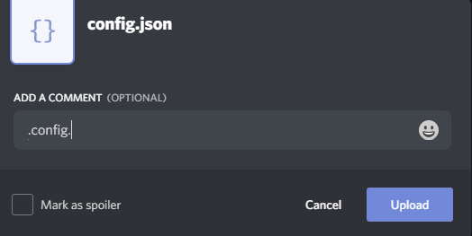

# Setup Guide

## JSON

PyBoat currently uses JSON files to store configurations.

This will later be changed to YAML, but for now will remain in JSON.

If you get JSON validation errors upon uploading your config, make sure it has no JSON problems!

JSON is very sensible and will often cause issues... use something like [https://jsonlint.com/](https://jsonlint.com/) to validate your JSON before inputting it to the bot.

Keep in mind that **you cannot have comments in JSON!** They are used in the configuration examples as context only

Unlike rowboat, theres is currently no online dashboard, and no plans to make one either. You may want to use something like notepad++ or a [online json editor](https://jsoneditoronline.org) to edit your server's config!

## Workings

The bot will not do anything by default until you pass it a config!

It does not load a config by default, and has nothing enabled by default.

Only the server owner or members with the "Administrator" permission can view or update the server's config.

In order to update or view the config, you will need to use the command: 

> .config.

Just typing it will give you the server's current config, or the default config if a server config isn't defined.

Typing it and attaching a config.json file with your message will update the server's config, like so:



## Default Config

In order to get the default config, just type the .config. command in chat.

The default config may change often, and I don't feel like updating this page with the new defaults whenever it does.

## Core Configuration

```text
{
	"levels": {
		"users": {
			"userid here": 200
		},
		"roles": {
			"roleid here": 200
		}
	},
	"modules": {
		"queue": true
	}
}
```

| Levels |  | Type |
| :--- | :--- | :--- |
| `users` | User ID Mapping of levels | {string: number} |
| `roles` | Role ID Mapping of levels | {string: number} |

| Modules |  | Type |
| :--- | :--- | :--- |
| `queue` | Whether to use the event queueing system or not | Boolean |

The queueing system will automatically queue up events for internal dispatching in the entire server whenever the bot hits internal processing ratelimits.

Having it enabled will essentially cause spammed events to be processed in batches across every module, meaning that you might see delays on logging or automod, this system is designed to help with discord ratelimiting \(for example, in the logging module, when executing events in batches, the bot tries to group up log messages within the same discord message to not hit ratelimits\).

Not every module has event queue compatibility/advantages, in which case those modules will execute individually but with queueing.

The queue system also helps the bot pull audit logs more efficiently, instead of calling the audit log fetch API whenever it receives an event, it can bunch up a lot of events and only poll audit logs once, and grab the data for all those events at once.

You can, of course, disable it entirely, though the bot may have trouble keeping up during heated event spam reception \(i.e. a raid is occuring\)

Going forward, to reduce compatibility issues, this will likely be forcebly enabled.

## Module Configuration

Each module has it's own sepperate configuration from the core, though every module shares a root configuration:

```text
{
	"levels": {},
	"modules": {
		"queue": true,
		"commands": {
			"enabled": true,
		}
	}
}
```


You must define "module"."enabled" to true for the module to do anything at all!


